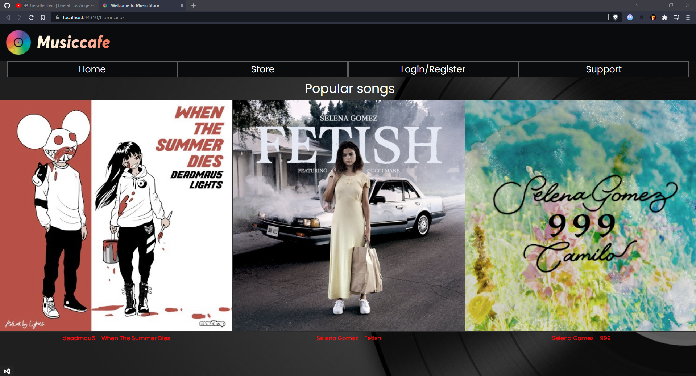
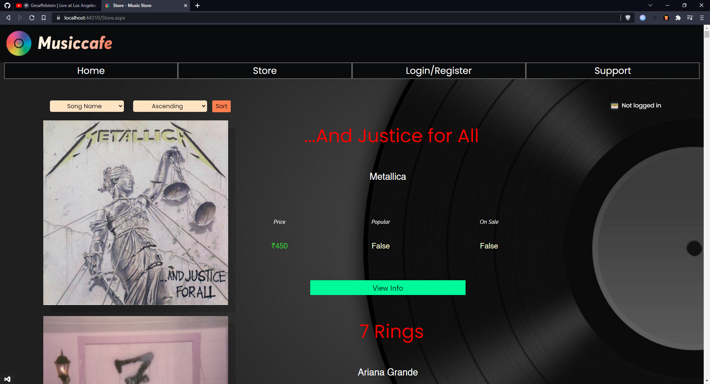
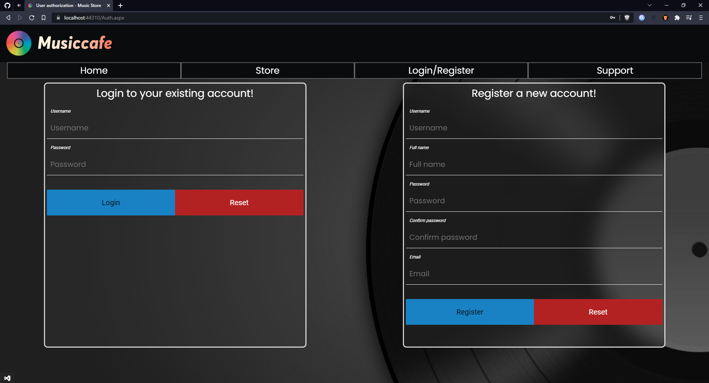
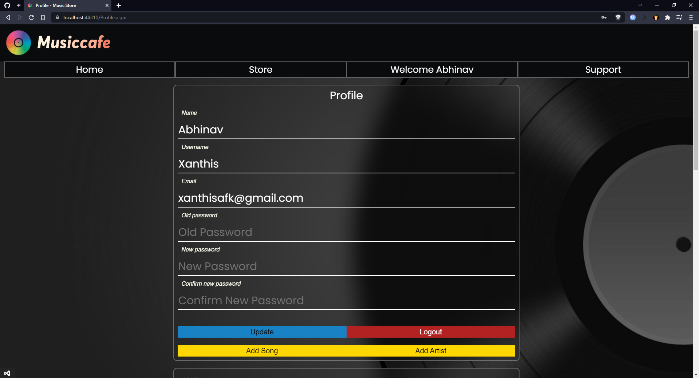
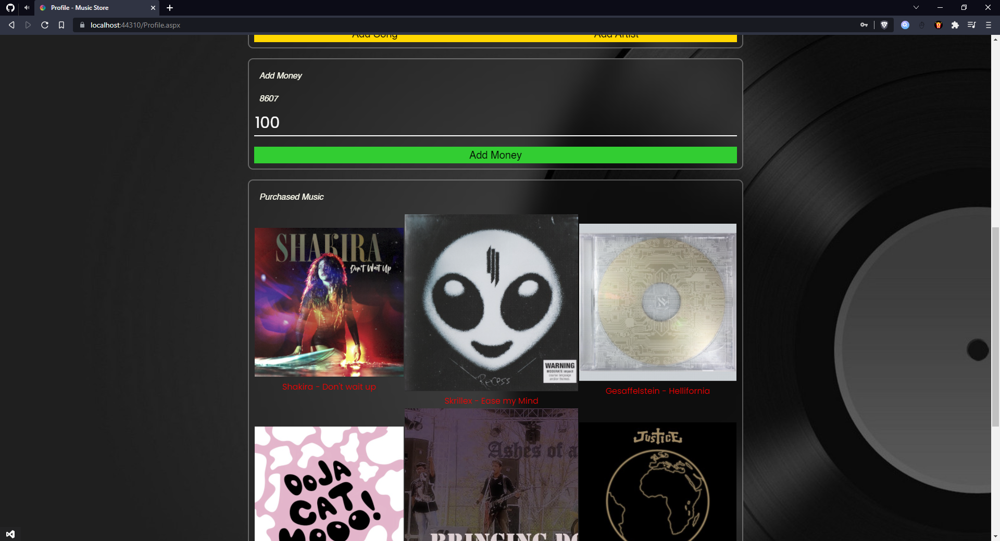
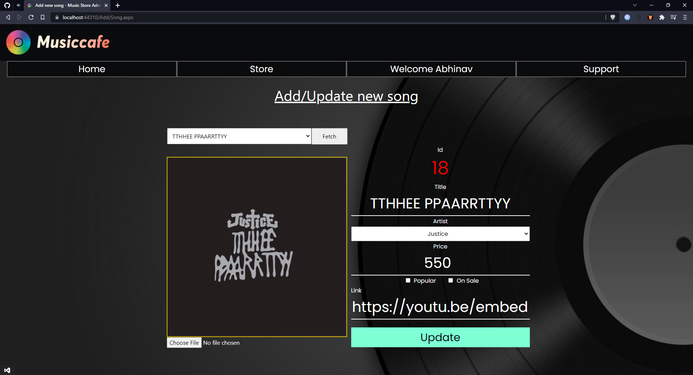
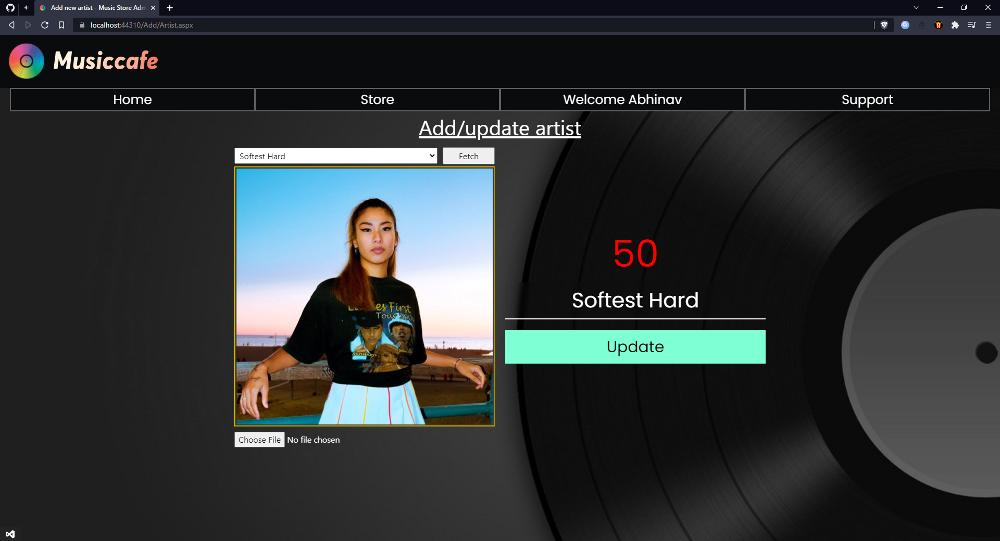
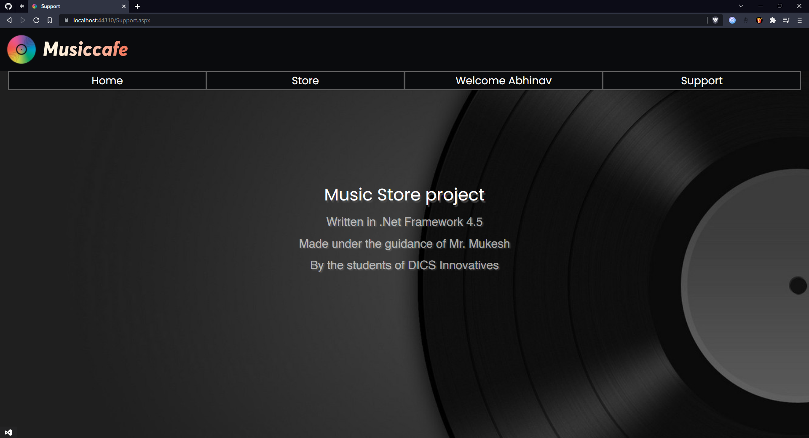

# Music Store project
### Written is ASP.Net Framework 4.5

Project for school. Performs CRUD operations from the webpage.

## Screenshots

Home
> 

Store
> 

Login page
> 

Profile
> 

Profile contd.
> 

Add a new song (admin operation)
> 

Add a new artist (admin operation)
> 

Support (Badly named credits)
> 

---
All the images belong to their respective owners.
Most of the pricing/popularity/sale data is randomly generated.
[Contact to remove something.](mailto:abhinav.ranger@gmail.com)
